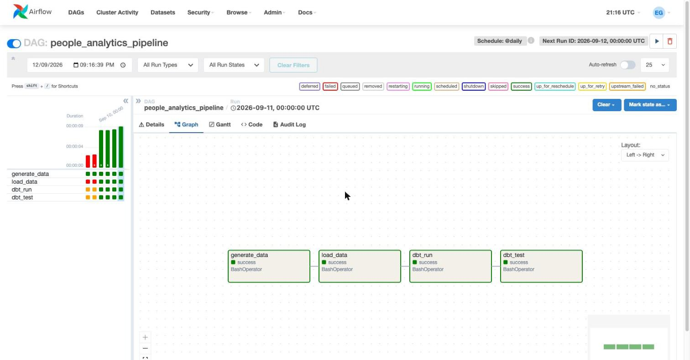
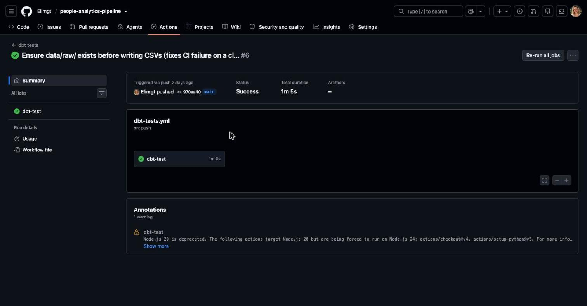

# People Analytics Pipeline

A data pipeline that simulates an ATS/HRIS export (job requisitions, candidates, recruiting funnel stages, offers), transforms it with dbt into recruiting metrics, and orchestrates it daily with Airflow.

Designed around real recruiting processes (funnel stages, sourcing channels, time-to-hire and offer-acceptance metrics) — the goal is to show what a Data Engineering pipeline looks like when applied to People Analytics.

## Architecture

```
generate_data.py → raw CSVs (simulate an ATS/HRIS export)
        │  load_data.py
        ▼
  Postgres (raw schema)
        │  dbt run
        ▼
  Postgres (analytics schema: staging → marts)
        │
        ▼
  metrics: time-to-hire, offer acceptance rate,
  funnel conversion by stage, source effectiveness

Orchestrated by Airflow (Docker) · Tested with dbt tests · CI on GitHub Actions
```

## Tech Stack

- **Python**: generates the synthetic recruiting data (`Faker`) and loads it into the database (`pandas`, `SQLAlchemy`, `psycopg2`).
- **PostgreSQL**: stores both the raw data and the transformed models.
- **dbt**: transforms raw data into clean models (staging → marts) and runs automated data quality tests.
- **Apache Airflow**: orchestrates the full pipeline as a daily DAG (generate → load → transform → test).
- **Docker / Docker Compose**: runs Postgres and Airflow as isolated, reproducible containers.
- **GitHub Actions (CI/CD)**: runs the dbt test suite automatically on every push.
- **Git / GitHub**: version control and the public repository.

## Data model

- `job_requisitions`: open/closed roles by department
- `candidates`: candidates, recruiting source, and which role they applied to
- `pipeline_stages`: funnel stage history per candidate (Applied → Screening → Interview → Offer → Hired/Rejected)
- `offers`: offers made, whether accepted, and when

## Metrics (`dbt_project/models/marts`)

- `fct_hiring_funnel`: candidates by stage and requisition
- `fct_time_to_hire`: days from application to hire
- `fct_offer_acceptance`: offer acceptance rate
- `fct_source_effectiveness`: hire rate by recruiting source

## Data Quality

The raw data intentionally simulates real-world messiness instead of arriving perfectly clean:

- Inconsistent recruiting source spellings/casing and stray whitespace (`"linkedin"`, `"  LinkedIn  "`, `"Linked In"`)
- Missing values (source, hiring manager, salary not always captured)
- Duplicate candidate export rows (a common ATS sync quirk)
- A few orphan funnel records referencing a candidate_id that no longer exists (e.g. a record purged for a data-retention request)

The `staging` models handle each of these explicitly: source values are standardized to a canonical set (falling back to `Unknown`), duplicates are deduplicated with a window function, and missing hiring managers are backfilled. The orphan-record case is caught by a dbt `relationships` test configured with `severity: warn`, so it surfaces as a tracked, known data-quality issue instead of silently breaking the pipeline.

## How to run it locally

1. Prerequisites: Docker Desktop, Python 3.11, dbt (`pip install -r requirements.txt`).
2. Start the database and Airflow: `docker compose up -d --build`
3. Generate sample data: `python src/generate_data.py`
4. Load it into Postgres: `python src/load_data.py`
5. Transform with dbt: `cd dbt_project && dbt run --profiles-dir . && dbt test --profiles-dir .`
6. View the DAG in Airflow: http://localhost:8080 (user `admin`, password `admin`)

## Screenshots

**Airflow DAG run — all 4 tasks succeeding:**



**CI passing on GitHub Actions:**



## What I learned / next steps

- Migrate the warehouse to BigQuery/Snowflake and raw data to an S3/GCS bucket.
- Incremental ingestion instead of a full replace.
- Add `dbt-expectations` for more advanced tests.
- Final dashboard (Metabase) on top of the `marts` models.
